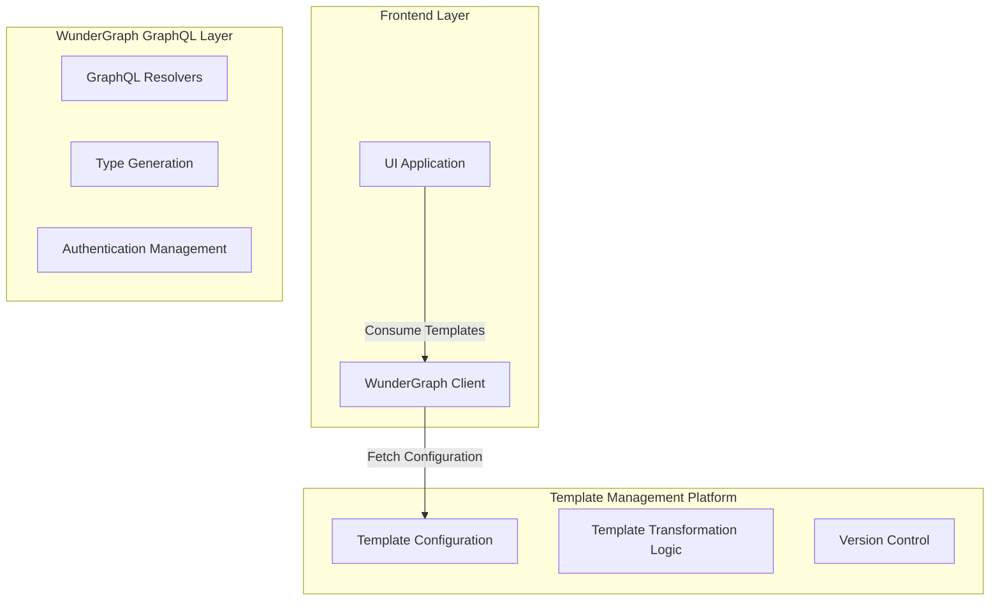
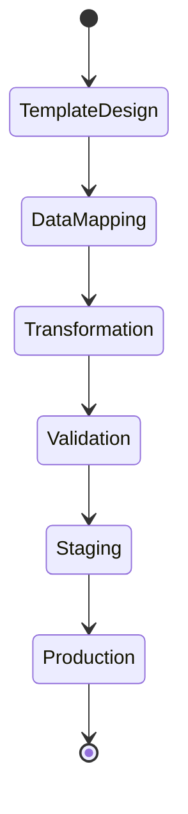

# Template Management Platform (TMP)
## Product Requirements Document

### Table of Contents
1. Executive Summary
2. Business Context
3. System Architecture
4. Key Features
5. Technical Requirements
6. User Experience
7. Security & Compliance
8. Performance Expectations

### 1. Executive Summary
The Template Management Platform (TMP) is a revolutionary solution designed to transform how our SaaS product manages and deploys user interfaces with unprecedented flexibility and minimal overhead.

### 2. Business Context

#### Strategic Objectives
- Reduce deployment complexity
- Enable rapid UI customization
- Centralize template management
- Minimize time-to-market for UI changes

### 3. System Architecture

#### High-Level Architecture

#### Workflow Diagram

### 4. Key Features

#### 4.1 Template Configuration
- Dynamic template creation
- Multi-source data integration
- Version-controlled templates
- Environment-specific configurations

#### 4.2 Data Transformation Capabilities
- GraphQL-native transformation
- Complex data mapping
- Real-time preview
- Performance optimization

### 5. Technical Requirements

#### Technology Stack
- WunderGraph
- GraphQL
- TypeScript
- Node.js
- Docker
- Kubernetes

#### Integration Capabilities
- REST API Support
- GraphQL Endpoints
- WebSocket Real-time Updates
- OAuth 2.0 Authentication

### 6. User Experience

#### User Roles
1. Template Administrator
2. Template Designer
3. Template Viewer

#### Interface Mockups

### 7. Security & Compliance

#### Security Features
- JWT Authentication
- Role-Based Access Control
- End-to-End Encryption
- Comprehensive Audit Logging

#### Compliance
- GDPR Compliance
- CCPA Ready
- SOC 2 Compatible

### 8. Performance Expectations

#### Performance Metrics
- 99.99% Uptime
- <100ms Template Retrieval
- Horizontal Scalability
- Efficient Caching Mechanisms

### 9. Monitoring & Observability
- Real-time Performance Dashboards
- Comprehensive Logging
- Anomaly Detection
- Performance Alerts

### 10. Future Roadmap
- AI-Assisted Template Generation
- Machine Learning Optimizations
- Enhanced Visual Editor
- Multi-Language Support

### Appendix
- Detailed Technical Specifications
- Security Whitepaper
- Integration Guidelines

---

**Prepared by:** [Your Name]
**Version:** 1.0
**Date:** [Current Date]
